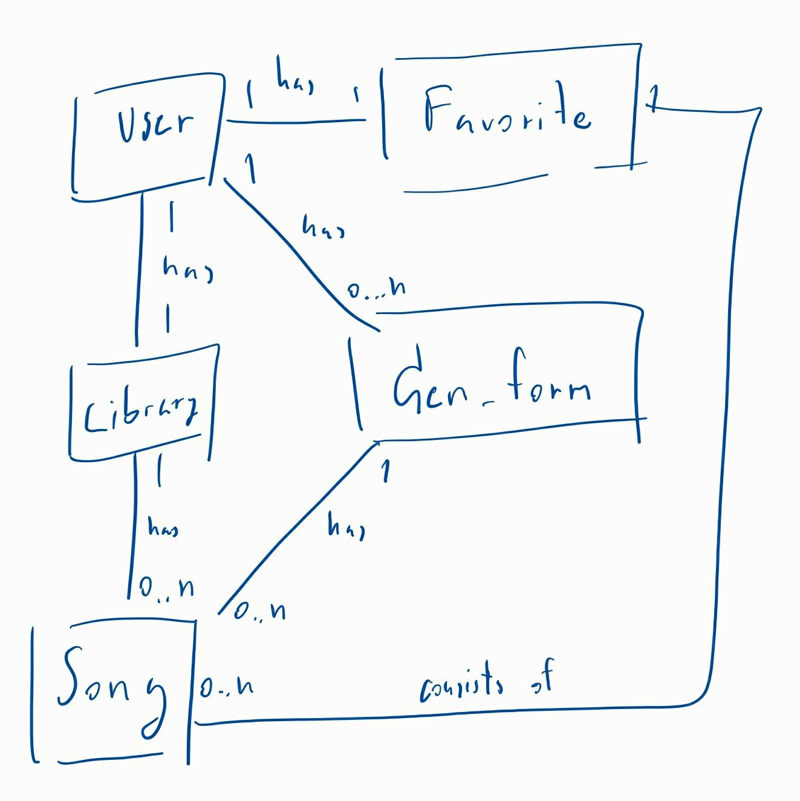
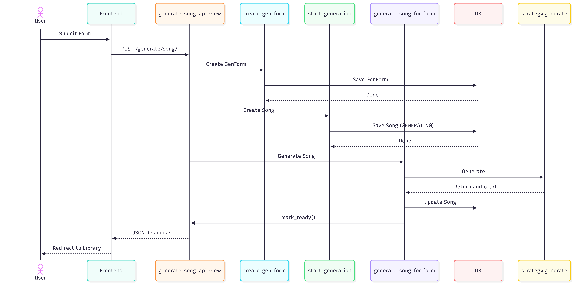

<a id="readme-top"></a>

<!-- PROJECT LOGO -->
<br />
<div align="center">
  <h1 align="center">🎵 SunoSong Django</h1>

  <p align="center">
    <strong>Modern Spotify-inspired music generation platform powered by Suno AI</strong>
    <br />
    Interchangeable generation strategies, real-time status tracking, and a premium dark-themed UI.
  </p>

</div>

<!-- TABLE OF CONTENTS -->
<details>
  <summary>Table of Contents</summary>
  <ol>
    <li>
      <a href="#about-the-project">About The Project</a>
      <ul>
        <li><a href="#built-with">Built With</a></li>
      </ul>
    </li>
    <li>
      <a href="#getting-started">Getting Started</a>
      <ul>
        <li><a href="#prerequisites">Prerequisites</a></li>
        <li><a href="#installation">Installation</a></li>
      </ul>
    </li>
    <li><a href="#song-generation-strategies-strategy-pattern">Strategy Pattern</a></li>
    <li><a href="#3-evidence-of-usage">Evidence of Usage</a></li>
    <li><a href="#4-minimal-demonstration">Minimal Demonstration</a></li>
  </ol>
</details>

<!-- ABOUT THE PROJECT -->
## About The Project

SunoSong Django is a full-stack music generation platform that transforms the Suno AI API into a sleek, Spotify-like user experience. It features a robust backend architecture using the **Strategy Pattern** to swap between real API generation and deterministic mock generation for testing.

Key Features:
* **Premium UI**: Glassmorphic dark theme with smooth animations and responsive layout.
* **Strategy Pattern**: Decoupled generation logic allowing easy switching between `mock` and `suno` modes.
* **Real-time Status**: Live polling for generation status via HTMX.
* **Full Library Management**: Search, favorite, download, and share your generated tracks.

<p align="right">(<a href="#readme-top">back to top</a>)</p>

### Built With

[![Django][Django-badge]][Django-url]
[![Python][Python-badge]][Python-url]
[![HTMX][HTMX-badge]][HTMX-url]
[![Vanilla CSS][CSS-badge]][CSS-url]
[![Google][Google-badge]][Google-url]
[![Suno][Suno-badge]][Suno-url]

<p align="right">(<a href="#readme-top">back to top</a>)</p>

<!-- GETTING STARTED -->
## Getting Started

### Prerequisites

* Python 3.14+
* Django 6.0+
* Suno API Key (from `api.sunoapi.org`)

### Installation

We highly recommend using a virtual environment to manage dependencies. Follow the instructions for your operating system:

#### 🍎 macOS / Linux

1. **Clone the repository**
   ```bash
   git clone https://github.com/ucula/SunoSongDjango.git
   cd SunoSongDjango
   ```
2. **Create and activate a virtual environment**
   ```bash
   python3 -m venv venv
   source venv/bin/activate
   ```
3. **Install dependencies**
   ```bash
   pip install -r requirements.txt
   ```
4. **Set up environment variables**
   ```bash
   cp .env.example .env
   ```
   *See the **Configuration** section below to set up your `.env` file.*
5. **Run migrations and start the server**
   ```bash
   python manage.py migrate
   python manage.py runserver
   ```

#### 🪟 Windows

1. **Clone the repository**
   ```powershell
   git clone https://github.com/ucula/SunoSongDjango.git
   cd SunoSongDjango
   ```
2. **Create and activate a virtual environment**
   ```powershell
   python -m venv venv
   .\venv\Scripts\activate
   ```
3. **Install dependencies**
   ```powershell
   pip install -r requirements.txt
   ```
4. **Set up environment variables**
   ```powershell
   copy .env.example .env
   ```
   *See the **Configuration** section below to set up your `.env` file.*
5. **Run migrations and start the server**
   ```powershell
   python manage.py migrate
   python manage.py runserver
   ```

### Configuration

Open the newly created `.env` file in your editor and provide the following required keys:

**1. Suno API:**
* `SUNO_API_KEY`: Get this from your [api.sunoapi.org](https://api.sunoapi.org) account.

**2. Google OAuth:**
To enable user authentication, you must configure a Google Cloud project:
1. Go to the [Google Cloud Console](https://console.cloud.google.com/).
2. Create a new project and navigate to **APIs & Services > Credentials**.
3. Click **Create Credentials** -> **OAuth client ID**.
4. Set the Application type to **Web application**.
5. Add your authorized redirect URIs (e.g., `http://localhost:8000/oauth/callback/google/`).
6. Copy the generated keys into your `.env` file:
   * `GOOGLE_OAUTH_CLIENT_ID`
   * `GOOGLE_OAUTH_CLIENT_SECRET`
   * `GOOGLE_OAUTH_REDIRECT_URI`

<p align="right">(<a href="#readme-top">back to top</a>)</p>

## Song Generation Strategies (Strategy Pattern)

The generation flow uses the Strategy Pattern to allow interchangeable generation logic.

* **mock**: Deterministic, offline generator for local development.
* **suno**: External API-backed generator using the Suno AI service.

<p align="right">(<a href="#readme-top">back to top</a>)</p>

## Architecture Diagrams

### Domain Model



### Song Generation Sequence Diagram



<p align="right">(<a href="#readme-top">back to top</a>)</p>

### 3. Evidence of Usage

#### How to run Mock Mode
Set `GENERATOR_STRATEGY=mock` in your `.env`. Songs will be generated instantly using placeholder data.

#### How to run Suno Mode
Set `GENERATOR_STRATEGY=suno` and ensure `SUNO_API_URL` is set to `https://api.sunoapi.org`.

#### Where to put the Suno API key
The API key must be placed in `.env` under `SUNO_API_KEY`. This file is ignored by Git to prevent security leaks.

<p align="right">(<a href="#readme-top">back to top</a>)</p>

### 4. Minimal Demonstration

The following logs demonstrate both strategies working correctly via the CLI demonstration script.

```text
[1] DEMONSTRATING MOCK STRATEGY
SUCCESS: Mock generation completed.
Result Title: Demo Song [mock-f2fe1e]

[2] DEMONSTRATING SUNO API STRATEGY
DEBUG: Suno API Task Created - taskId: 9b65516ae84c015fd0d2e6d535190693
DEBUG: Suno API Polling - taskId: 9b65516ae84c015fd0d2e6d535190693, status: SUCCESS
SUCCESS: Suno generation completed.
```

<p align="right">(<a href="#readme-top">back to top</a>)</p>

<!-- MARKDOWN LINKS & IMAGES -->
[Django-badge]: https://img.shields.io/badge/Django-092E20?style=for-the-badge&logo=django&logoColor=white
[Django-url]: https://www.djangoproject.com/
[Python-badge]: https://img.shields.io/badge/Python-3776AB?style=for-the-badge&logo=python&logoColor=white
[Python-url]: https://www.python.org/
[HTMX-badge]: https://img.shields.io/badge/HTMX-3366CC?style=for-the-badge&logo=htmx&logoColor=white
[HTMX-url]: https://htmx.org/
[CSS-badge]: https://img.shields.io/badge/Vanilla_CSS-1572B6?style=for-the-badge&logo=css3&logoColor=white
[CSS-url]: https://developer.mozilla.org/en-US/docs/Web/CSS
[Suno-badge]: https://img.shields.io/badge/Suno_API-FF6B6B?style=for-the-badge&logo=music&logoColor=white
[Suno-url]: https://api.sunoapi.org
[Google-badge]: https://img.shields.io/badge/Google_OAuth-4285F4?style=for-the-badge&logo=google&logoColor=white
[Google-url]: https://developers.google.com/identity/protocols/oauth2
